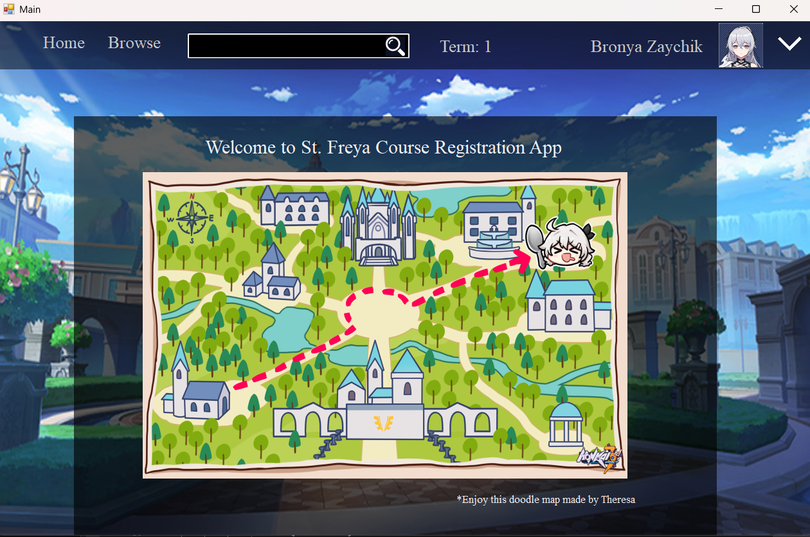
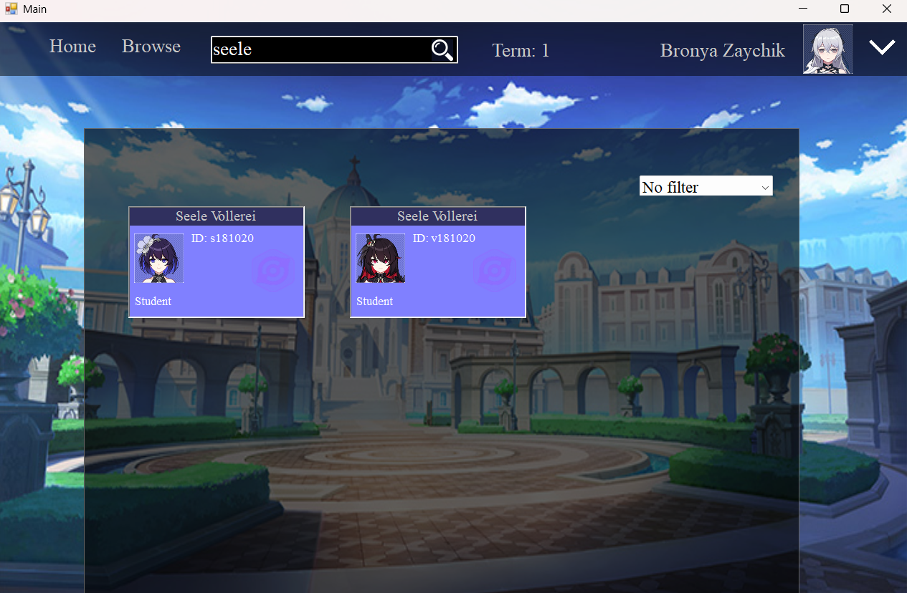
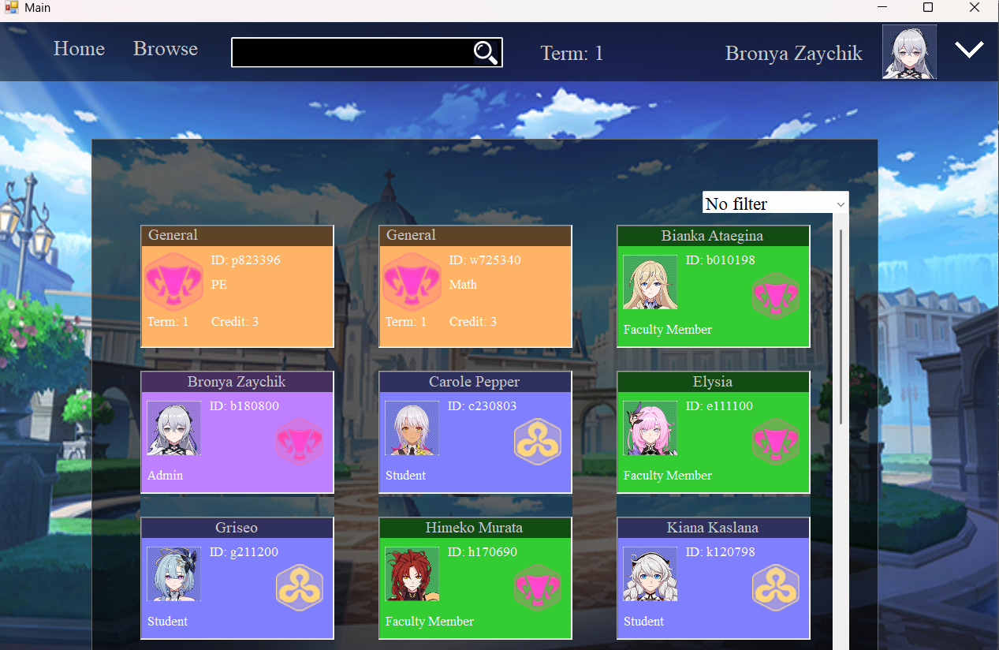
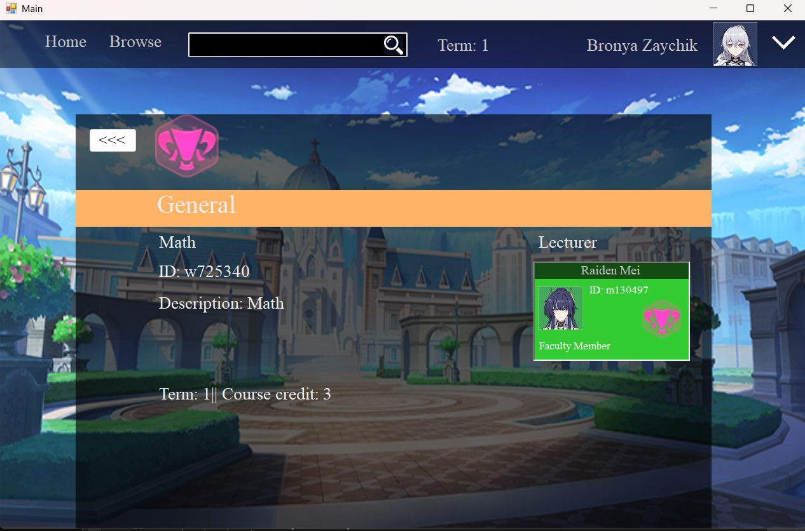
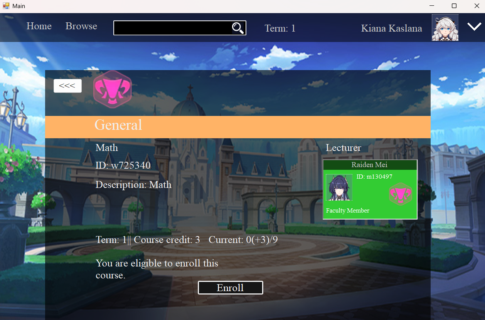
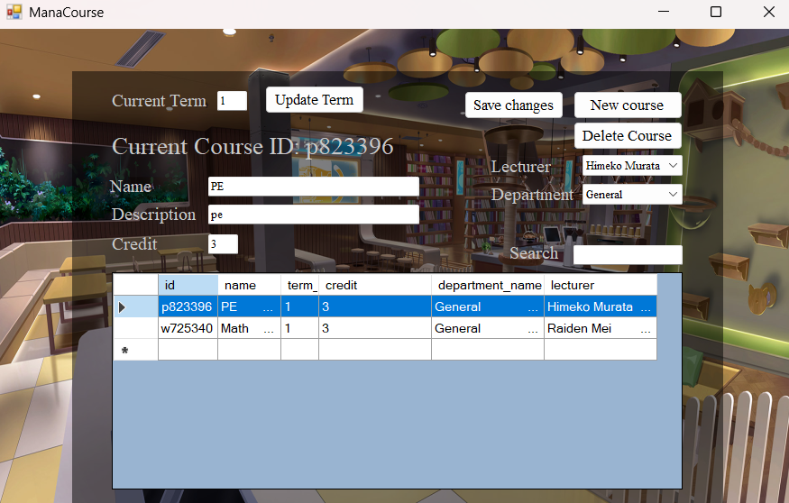
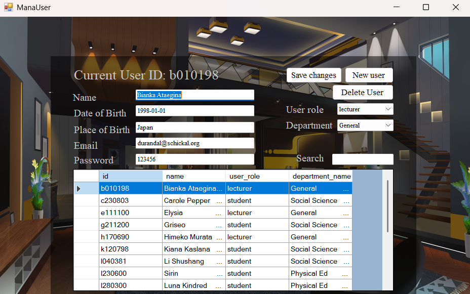
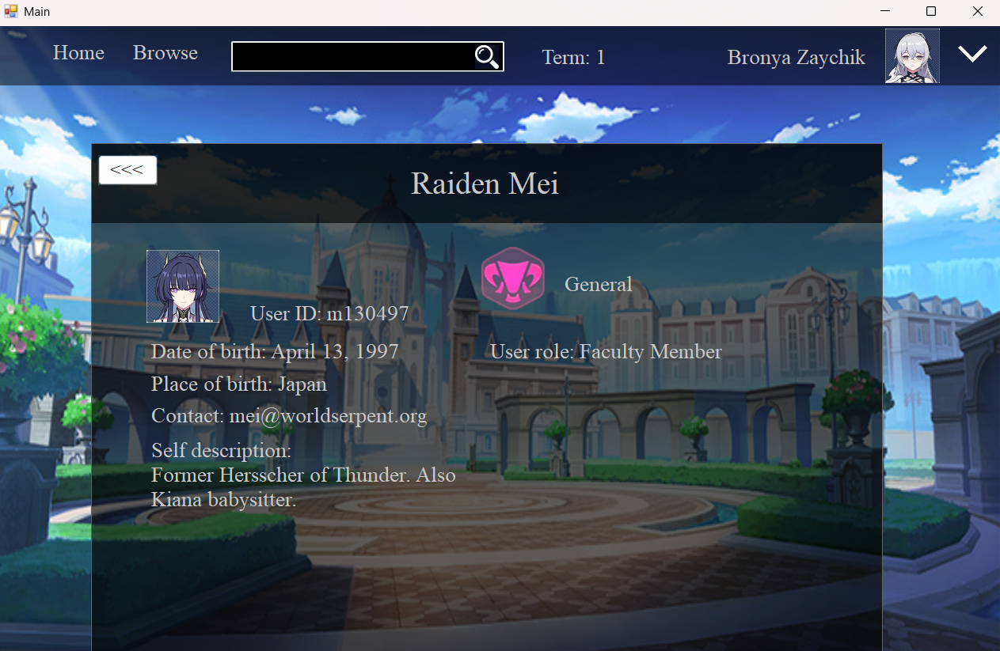

# 📚 Course Registration System

A desktop + web application built with **Windows Forms**, **SQL Server**, and a web frontend to manage students, courses, and users.

---

## 🖼️ Screenshots

<table>
  <tr>
    <td align="center">
      🏠 <b>Main Page</b> 
      
    </td>
    <td align="center">
      🔍 <b>Search Student</b> 
      
    </td>
  </tr>
  <tr>
    <td align="center">
      🔎 <b>Search with No Filter</b> 
      
    </td>
    <td align="center">
      📘 <b>Course Info – Admin View</b> 
      
    </td>
  </tr>
  <tr>
    <td align="center">
      📗 <b>Course Info – Student View</b> 
      
    </td>
    <td align="center">
      🛠️ <b>Manage Courses</b> 
      
    </td>
  </tr>
  <tr>
    <td align="center">
      👤 <b>Manage Users</b> 
      
    </td>
    <td align="center">
      📄 <b>User Info</b> 
      
    </td>
  </tr>
</table>

---

## 🧠 Features

- Search, view, and filter student and course data
- Different views for Admin, Faculty and Student roles
- Course creation, editing, and user management
- Connected to **SQL Server** backend
- Frontend includes a web interface for student interaction *(optional)*

---

## 🛠 Built With

- 💻 **C#** (.NET Windows Forms)
- 🗃️ **SQL Server**
- 🧩 Entity Framework

---

> *Images shown above are from an in-development project. Data shown is for demonstration purposes only.*
